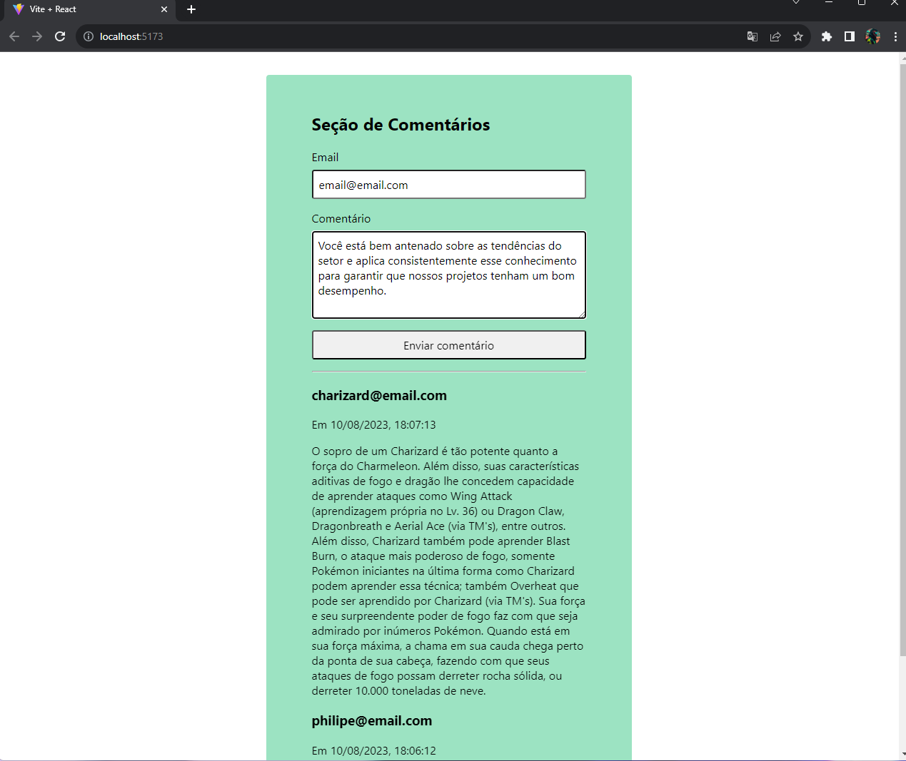

# Seção de Comentários - Aplicativo React
Um aplicativo React simples que permite aos usuários deixar comentários e exibe os comentários em uma seção logo abaixo do formulário.





## Índice

- [Visão Geral](#visão-geral)
- [Instruções de Uso](#instruções-de-uso)
- [Tecnologias Utilizadas](#tecnologias-utilizadas)
- [Contribuição](#contribuição)
- [Licença](#licença)

  
## Visão Geral

Este projeto é um exemplo de um aplicativo React que demonstra como criar uma seção de comentários interativa. Os usuários podem preencher um formulário com seu nome e um comentário, que serão exibidos na seção de comentários abaixo do formulário. Cada comentário exibe o nome do autor, a data e hora de criação, bem como o conteúdo do comentário.

## Instruções de Uso

1. Certifique-se de ter o [Node.js](https://nodejs.org/) instalado em sua máquina.

2. Clone este repositório para o seu ambiente local:

   ```bash
   git clone <https://github.com/philipeagra/Comentarios-com-react.git>

3. Navegue até o diretório do projeto:

  ```bash
  cd nome-do-diretório

4. Instale as dependências:

```bash
npm install

5. Inicie o aplicativo:
  ```bash
  npm run dev


Abra o seu navegador e visite http://localhost:3000 para ver o aplicativo em ação.

Preencha o formulário com um nome de autor e um comentário, e clique em "Enviar comentário" para adicionar um novo comentário à seção.

Tecnologias Utilizadas
React: Biblioteca JavaScript de código aberto para construir interfaces de usuário.
useState: Hook do React para gerenciar o estado dos componentes.
Date: Objeto JavaScript para lidar com datas e horários.
Contribuição
Contribuições são bem-vindas! Se você encontrar problemas ou tiver sugestões de melhorias, sinta-se à vontade para abrir uma issue ou enviar um pull request.

Licença
Este projeto está licenciado sob a Licença MIT.

javascript
Copy code

Certifique-se de substituir `<URL_DO_REPOSITÓRIO>` pe
